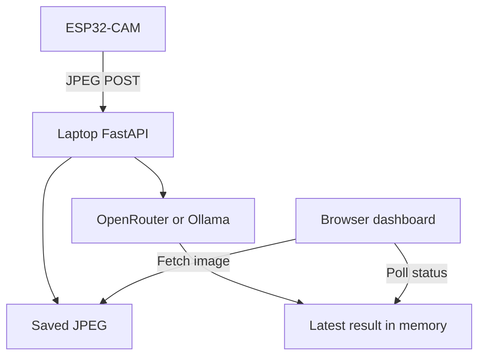

# ESP32-CAM Visual Memory Engine

A camera-to-VLM prototype evolving toward evidence-backed household memory: **“Where was this registered object last seen?”**

The working code sends JPEG snapshots from an AI Thinker ESP32-CAM to a laptop-hosted FastAPI service, saves the normalized images, and displays the latest VLM description. The proposed next stage uses an existing Seeed reComputer J1010 as a home gateway, with event storage and retrieval.

> **Status:** research prototype. Last-seen retrieval, local object detection, J1010 deployment, authentication, cloud synchronization and alerts are proposed capabilities, not implemented features.

## Why this project

Caregivers need useful context without searching through every captured image. The goal is to return a specific object, its last observed location, timestamp and supporting snapshot, with uncertainty made explicit. An old observation is not proof of an object's current location.

| Implemented today | Proposed next stage |
|---|---|
| One camera sends raw JPEG over local HTTP | Device identities, bounded ingestion and durable jobs |
| Server normalizes and saves images | Retention policy and separate evidence storage |
| OpenRouter or Ollama describes each image | Change filtering and selective semantic interpretation |
| Dashboard shows the latest result | Registered-object last-seen query and timeline |
| Latest result lives in process memory | SQLite observations/events, then optional cloud sync |

## Current architecture

The provider call happens inside the upload request. There is no background queue.



## Documentation

- [Solution architecture](docs/solution-architecture.md): current behavior, target HLD, memory contracts, deployment alternatives and failure handling.
- [Sizing and BOM](docs/sizing-and-bom.md): J1010 constraints, capacity calculations, purchasing priorities and validation gates.
- [Technical proposal](docs/technical-proposal.md): pilot scope, business and technical value, delivery phases and acceptance criteria.
- [Visual Memory Engine project brief](visual_memory_engine_project_brief.md): deeper product concept and long-term research direction.

The project brief remains the product source. The architecture documents adapt it to a constrained J1010 pilot; SQLite is a deliberate initial deployment choice before the brief's PostgreSQL option.

## Run the current laptop prototype

Use a Python virtual environment. The repository contains a Python 3.10-generated cache, but does not pin a supported Python/dependency matrix; verify your environment rather than treating that cache as a compatibility guarantee.

From the repository root:

```bash
python -m venv .venv
```

Activate it:

```powershell
# Windows PowerShell
.\.venv\Scripts\Activate.ps1
```

```bash
# Linux / macOS
source .venv/bin/activate
```

Then:

```bash
python -m pip install -r laptop/requirements.txt
```

Create a **root-level .env** with the following values, replacing the example key and model. If you already have `laptop/.env`, update it consistently or remove it after keeping any needed local settings: `load_dotenv()` can find that nearer file before the root configuration.

```dotenv
VLM_PROVIDER=openrouter
OPENROUTER_API_KEY=YOUR_OPENROUTER_KEY
VLM_MODEL=YOUR_IMAGE_CAPABLE_MODEL_ID
```

**Configuration correction:** the existing [laptop/.env.example](laptop/.env.example) still uses `VLM_PROVIDER=openai` and `OPENAI_API_KEY`. Those values do not match [the current provider dispatcher](laptop/app.py). If copying that file, replace them with the OpenRouter values above. Choose an available image-capable model in your provider account; model availability and pricing can change.

For an already running Ollama server with an installed vision model, use instead:

```dotenv
VLM_PROVIDER=ollama
OLLAMA_BASE_URL=http://127.0.0.1:11434
VLM_MODEL=YOUR_INSTALLED_VISION_MODEL
```

Ollama is optional on a suitable laptop/workstation. Its presence in the code is not evidence that a vision model will fit on the J1010.

Start the service from the repository root:

```bash
python -m uvicorn laptop.app:app --host 0.0.0.0 --port 8000
```

Open http://127.0.0.1:8000 in your browser. Keep credentials in local configuration, outside version control.

## Connect the ESP32-CAM

1. Open [esp32cam_vlm.ino](esp32cam/esp32cam_vlm/esp32cam_vlm.ino) in Arduino IDE with ESP32 board support. Select the matching AI Thinker ESP32-CAM board and serial port. No PlatformIO project configuration is supplied.
2. Copy [secrets.h.example](esp32cam/esp32cam_vlm/secrets.h.example) to `secrets.h` in the same sketch folder.
3. Fill in `WIFI_SSID`, `WIFI_PASSWORD` and `SERVER_IP`. Use the laptop's LAN IPv4 address, not localhost. On Windows, inspect `ipconfig`.
4. Connect the camera and laptop to a mutually reachable LAN; permit port 8000 only on the trusted local network.
5. Upload using your board/programmer's flashing procedure, reset into normal boot, then inspect Serial Monitor at 115200 baud.

With PSRAM the sketch selects 640×480 JPEG; without it, 320×240. It posts the JPEG body to `http://SERVER_IP:8000/camera/frame`, waits for the request to finish, then delays 10 seconds. It does not maintain an exact one-frame-per-10-second schedule.

## Verify the data path

Without the camera, send a non-sensitive JPEG from your computer:

```bash
curl -X POST -H "Content-Type: image/jpeg" --data-binary "@test.jpg" http://127.0.0.1:8000/camera/frame
```

On Windows PowerShell, use `curl.exe` if `curl` resolves to a PowerShell command.

| Check | Expected behavior |
|---|---|
| `GET /` | Dashboard HTML |
| `POST /camera/frame` | JSON containing timestamp, VLM text, filename and saved size |
| `GET /status` | Latest in-memory result |
| `GET /captures/{filename}` | Saved image, or 404 |
| Provider failure | Upload can still return 200 with an error message in the VLM text |

A successful HTTP response is not proof that AI interpretation succeeded. Captures are normalized to fit within 1024×1024, re-encoded as JPEG quality 82, and saved under `laptop/captures/`. The displayed timestamp is generated after processing; it is not a device capture timestamp.

## Known prototype limitations

- No device or viewer authentication, retention cleanup, durable job queue or structured memory database.
- Blocking provider HTTP calls run within an async upload handler. Camera request timeout is 15 seconds; provider timeout is 120 seconds. Slow inference can cause camera timeouts even if a frame was saved.
- No image-size limit or production request hardening; use only on a trusted LAN. Do not forward port 8000 to the public Internet.
- One global latest-result object cannot represent independent multi-camera state. Restarting loses that state even though saved JPEGs remain.
- Small objects, occlusion and sparse sampling limit what can be observed. Scene descriptions are not validated object identity or safety conclusions.

## Next milestones

1. Separate ingestion from inference; add device IDs, durable jobs, health reporting and retention.
2. Build object registration, observation/event storage and last-seen retrieval with evidence.
3. Validate one camera and several registered objects, then benchmark the J1010.
4. Add cameras and selective cloud reasoning only after capacity and accuracy gates pass.

The system is intended to assist caregivers. It does not establish medication consumption, resident safety or emergency detection.
