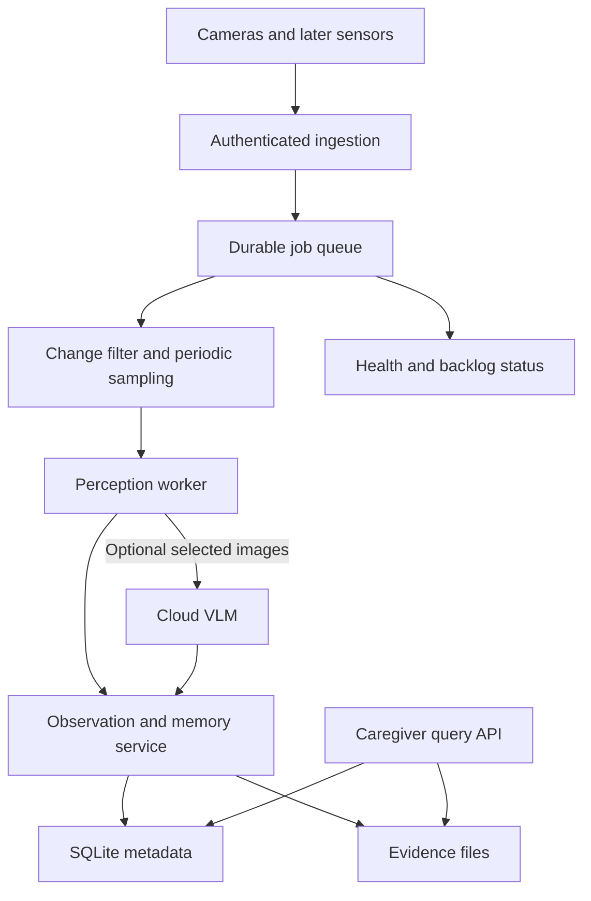
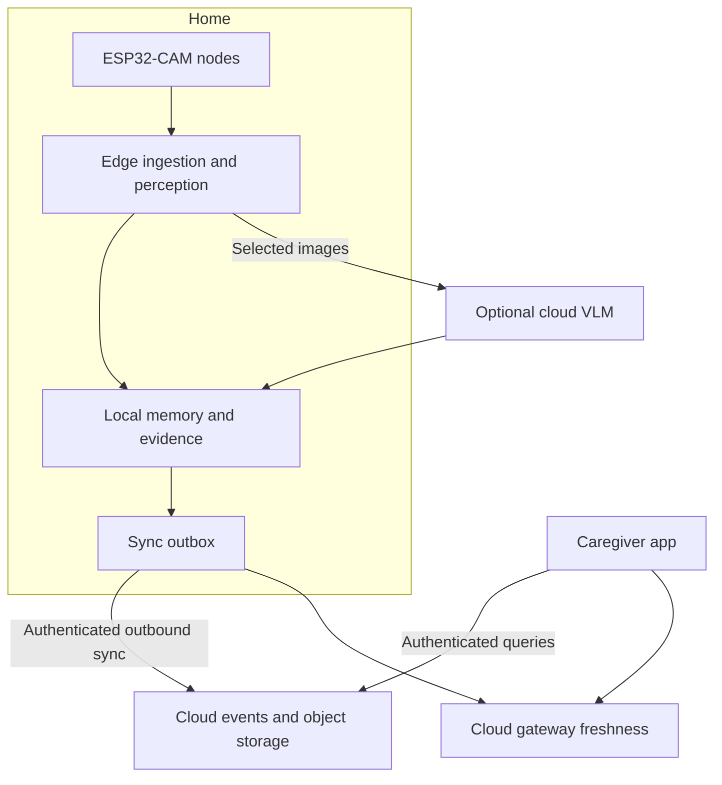

# Solution architecture

[README](../README.md) · [Sizing and BOM](sizing-and-bom.md) · [Technical proposal](technical-proposal.md)

**Design date:** 2026-09-03. **Status:** proposed architecture, grounded in the source at commit `ee055d6afa5404f827ea1384cd03c448245d58ee`. No J1010 performance benchmark is claimed.

## 1. Scope and design drivers

The first useful outcome is evidence-backed last-seen retrieval for a small set of registered household objects. Preserve the [project brief's](../visual_memory_engine_project_brief.md) separation of observations, events and derived state.

Design for one household, one camera initially, a 4 GB J1010 gateway, intermittent Internet and a caregiver who needs a short answer with evidence. Support optional cloud reasoning without making cloud availability a prerequisite for browsing already stored history.

The pilot excludes reliable fall detection, medication adherence verification, autonomous emergency action, full-room coverage guarantees and facial recognition. Future sensors and multi-household services reuse the event model but are separate phases.

## 2. Current implementation

| Area | Source-backed behavior | Consequence |
|---|---|---|
| Camera | VGA with PSRAM, QVGA without; raw JPEG POST | Resolution and image size vary |
| Scheduling | Blocking upload followed by 10-second delay | Actual interval includes upload/inference wait |
| Ingestion | `POST /camera/frame` reads the whole body | No bounded upload or durable queue |
| Processing | Pillow normalization then synchronous OpenRouter/Ollama call | Slow inference holds the request and can block the event loop |
| Persistence | Normalized JPEGs in `laptop/captures/` | No cleanup, structured history or DB |
| User state | Global `last_result`; browser polls every 2.5 seconds | Latest result only, lost at restart |
| Errors | AI exceptions converted into text; outer errors return 400 | HTTP 200 can contain a failed interpretation |
| Security | Plain LAN HTTP, no auth in these routes | Not suitable for public exposure |

The camera's 15-second timeout and provider's 120-second timeout are inconsistent. The server timestamp reflects completion, not capture time. Original full-resolution JPEGs are not retained by the current normalization path. The code supports OpenRouter and Ollama, not a direct Gemini adapter; an image-capable Gemini model through a supported provider would still require account/model configuration.

## 3. Proposed logical architecture



These are logical responsibilities, not a requirement for a container per box. Begin with one API process, one bounded worker and a shared local data volume. Serve a small web interface from the API. Use service supervision and restart policies. Containerize only after the J1010's ARM64 runtime and dependencies are verified; Kubernetes is outside this pilot.

## 4. Deployment alternatives

| Option | Edge responsibilities | Remote dependencies | Suitable stage |
|---|---|---|---|
| A: local-first pilot | API, queue, filtering, memory, evidence, dashboard; optional small detector | None for local history; optional VLM and private remote network | Recommended first implementation |
| B: hybrid household | Same local pipeline plus selective event sync | VLM, cloud auth, PostgreSQL/object storage, caregiver app | After local memory passes validation |
| C: multi-household service | Supported gateways, bounded buffering and local processing | Tenant isolation, fleet management, event ingestion, cloud app and monitoring | Separate product investment |

**Recommendation:** implement A with interfaces that permit B. Reuse the owned J1010, but keep the laptop as a development and fallback host. Do not purchase more Nano units for a fleet before assessing platform lifecycle and maintenance.

### Hybrid target



The edge owns observations and event history. Cloud copies carry stable IDs, household ID, source timestamp and sync timestamp. Keep append-only event uploads idempotent. Separate cloud-owned caregiver settings from edge-owned observations; version settings and apply them with explicit acknowledgments rather than blind two-way SQLite replication.

Use a persistent outbox with retry/backoff and a maximum backlog age/size. Sync only approved snapshots and selected metadata. Process deletion requests on edge and cloud, retaining a deletion marker long enough to prevent offline replay from restoring deleted data.

## 5. Ingestion contract and processing

The following versioned routes are **proposed**, not available in current code. Preserve `/camera/frame` during migration with an adapter if needed.

| Interface | Contract |
|---|---|
| `POST /api/v1/frames` | JPEG body, device credential, camera ID, boot/session ID, sequence number, optional capture time |
| `GET /api/v1/jobs/{id}` | Accepted, processing, completed, failed or expired |
| `POST /api/v1/objects` | Register item and references; caregiver authorization required |
| `GET /api/v1/objects/{id}/last-seen` | Latest accepted observation with time, place, evidence and freshness |
| `GET /api/v1/objects/{id}/timeline` | Ordered observations/events, including corrections |
| `GET /api/v1/health` | Ingestion, worker, storage, camera freshness and optional cloud status |

Proposed frame flow:

1. Validate credentials, content type, payload limit and decoded pixel limits before processing. Begin with a 1 MiB payload cap and a decoded limit matched to the configured camera; reject oversized requests with 413.
2. Derive an idempotency key from camera ID, boot/session ID and sequence. A duplicate returns the existing job ID. Store edge receive time independently of device time and flag unsynchronized clocks.
3. Write the image atomically under a generated ID on the data volume, then commit the job row. Return 202 only after both exist durably. A startup reconciliation removes orphan files or marks missing evidence explicitly.
4. A worker claims a job with a lease; recovery reclaims expired leases. Separate local work from slow cloud calls using bounded concurrency, deadlines and a circuit breaker.
5. Generate candidates using change filtering **plus periodic unfiltered samples**. Motion-only gating can miss static objects, subtle movements or the initial scene.
6. Validate perception output against a schema; save observation, model/version and evidence linkage. Keep confidence and claim type separate.
7. Compress repeated observations into meaningful events, derive last-seen state, and queue permitted sync/notification work.

Bound pending work by bytes and age, not only job count. On overload return 429/503 with retry guidance; never acknowledge data that will be silently dropped. Expire low-value work explicitly, expose gaps, and prioritize newer observations without rewriting history. ESP32 retries require bounded backoff and buffer limits; the present sketch does not implement these semantics.

## 6. Memory and identity

| Record | Minimum fields | Role |
|---|---|---|
| Camera | camera_id, room_id, landmark map, last_seen_at | Source and freshness |
| Object | object_id, label, reference IDs, registration version | Specific item identity |
| Observation | observation_id, camera_id, object candidate, captured_at, received_at, claim type, confidence, model version | Immutable evidence-based assertion |
| Evidence | evidence_id, path, hash, size, expiry, availability | Snapshot lifecycle |
| Event | event_id, type, observation IDs, event time | Movement or state transition supported by observations |
| Current state | object_id, latest accepted observation ID | Rebuildable query cache |
| Clarification | candidate IDs, reviewer, decision, revision time | Auditable human correction |
| Job / outbox | id, status, attempt count, next retry, expiry | Recovery and delivery |

Use indexed structured queries for last-seen before adding vector search. The brief's PostgreSQL direction remains appropriate for a larger service; local SQLite reduces pilot operations. WAL supports overlapping readers and a writer, but only one writer at a time, and requires local-host storage rather than a network filesystem. Keep write transactions short and use a proper SQLite backup procedure. [SQLite WAL documentation](https://www.sqlite.org/wal.html)

A detector recognizing “watch” does not identify a particular registered watch. Begin with a small registered set, controlled camera positions, several reference views and human review for ambiguous candidates. Benchmark embeddings or dedicated instance matching separately before trusting them. Tiny keys and glasses may require closer camera placement or higher-detail evidence.

An illustrative **proposed** response:

```json
{
  "object_id": "watch-01",
  "claim_type": "observed",
  "location": "Living room / coffee table",
  "observed_at": "2026-09-03T12:05:00Z",
  "camera_id": "living-room-01",
  "evidence_id": "evidence-042",
  "evidence_available": true,
  "identity_status": "human_confirmed",
  "freshness": "historical",
  "current_location_known": false
}
```

Do not promote a later low-confidence match over an earlier reliable one. Order by trustworthy observation time with deterministic ties; handle delayed arrivals. If the item disappears into a pocket, retain the last visible observation, mark current state unknown, and avoid invented locations. When evidence expires, mark it unavailable rather than returning a broken image link.

## 7. Access, privacy and trust boundaries

- Camera-to-edge: individual credentials, isolated trusted LAN and HTTPS where validated on the firmware; do not treat shared Wi-Fi as authorization.
- Edge-to-cloud: outbound TLS, provider credentials on the gateway, selected images only, configurable consent and retention. “Edge-first” does not mean images never leave the home.
- Caregiver-to-edge: propose Tailscale for private device access, restricted to approved devices/users, plus application authentication. It creates an encrypted private network; it does not host the dashboard or guarantee that peers cannot learn network endpoint addresses. [Tailscale overview](https://tailscale.com/docs/concepts/what-is-tailscale)
- Caregiver-to-cloud: per-user accounts, household membership, object-storage access policies and tenant authorization. Supabase row-level security must be enabled and policies tested for exposed tables; never put privileged service credentials in the browser. [Supabase RLS](https://supabase.com/docs/guides/database/postgres/row-level-security)
- Human controls: approved camera placement, visible pause control, no private-room deployment by default, role-restricted registration and correction, deletion and access audit.
- Treat image text and VLM output as untrusted data, never as instructions to execute commands, change permissions or send alerts.

For browser access without a private-network client, evaluate an authenticated tunnel as a later alternative. A tunnel alone does not add application authorization. For multiple households prefer outbound edge sync into a cloud service, with administrative access separate from caregiver access.

## 8. Failure behavior and recovery

| Failure | Required target behavior |
|---|---|
| Internet/provider unavailable | Keep local ingest/history; mark semantic results pending/unavailable; cap retry backlog |
| Home LAN/camera outage | Mark camera stale; show observation gaps; ESP32 resumes bounded attempts |
| Gateway reboot | Recover durable jobs and DB; rebuild latest state; show downtime |
| SSD absent/full | Fail ingestion visibly before falling back to eMMC; enforce reserve and retention |
| Cloud copy stale | Show last edge sync and capture time; do not present it as live |
| Model ambiguity | Return unknown or a review candidate, not a factual memory |
| Alert delivery failure | Record pending/failed status and retries; never equate send attempt with receipt |
| Clock drift | Preserve receive time and clock-quality status; avoid misleading event ordering |
| Power loss | Recover DB, reconcile files/jobs and verify evidence hashes where needed |

Use mount checks and service dependencies so missing storage cannot quietly fill the root filesystem. Back up metadata and necessary evidence to an independent destination; another folder on the same SSD is not a hardware-failure backup. Proposed pilot recovery objective: restore service within 30 minutes after a recoverable restart; daily backups imply up to 24 hours of loss after total storage failure. Validate both rather than calling them guarantees.

## 9. Evolution and key decisions

| Decision | Rationale | Revisit when |
|---|---|---|
| Local SQLite and files | Fits one gateway and simple operation | Multi-user writes or cloud reporting justify PostgreSQL |
| One inference worker | Avoid duplicate model allocations | Benchmarks demonstrate capacity |
| Selective cloud VLM | Keep semantics available without a local large model | Offline semantics becomes necessary or cloud cost exceeds budget |
| Structured last-seen first | Direct, auditable answers | Real queries need semantic similarity |
| Retain periodic samples | Reduce blind spots caused by filtering | Evaluation supports a different cadence |
| Reuse J1010 | Low incremental pilot cost | Runtime support, RAM, latency or hardware lifecycle blocks progress |

Before enabling caregiver alerts, validate event accuracy, duplicate suppression, delivery reporting and recipient configuration in a separate trial. Medication interaction and stove imagery remain observational context; neither is a substitute for verified adherence or a dedicated safety sensor.
